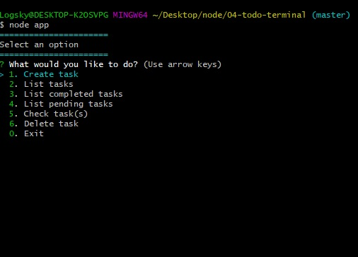

# About this app:
To-do app created with Node js, [inquirer](https://www.npmjs.com/package/inquirer) and [colors](https://www.npmjs.com/package/colors).

## Stuff you can do:

- Create a task
- Delete a task
- List tasks
- Filter tasks by status (completed or pending)
- Save your tasks in a json file

## Screenshot:

